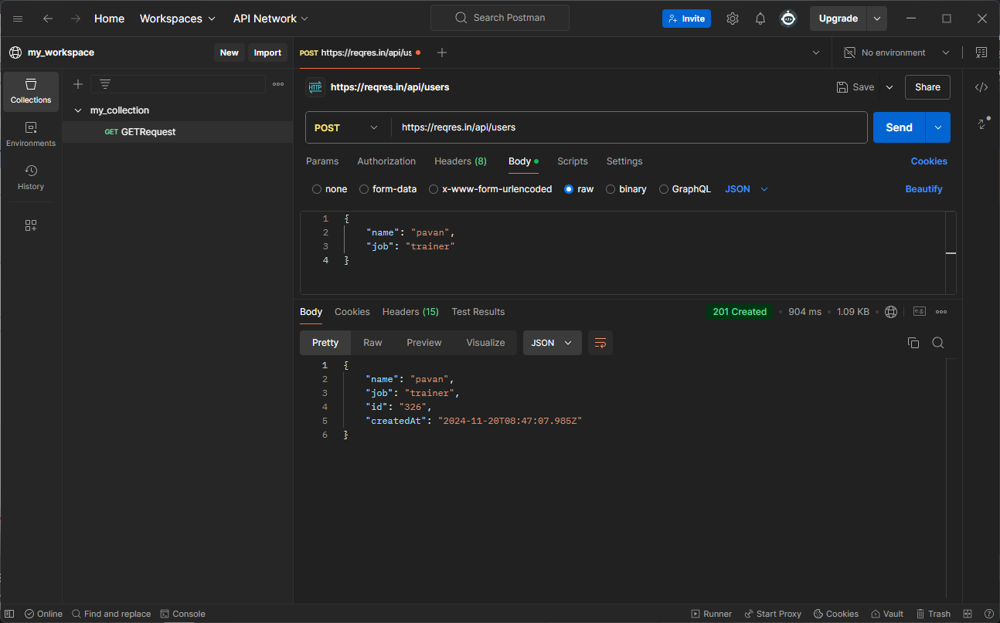

# API测试笔记
## API
### API的定义
API(应用程序接口,Application Programming Interface) 是一组预定义的规则、协议和工具,用于让不同的软件系统之间进行互相通信和交互。它定义了一个软件组件或应用如何与另一个组件或服务进行交互。

简单来说,API就像是一个“中介”或“桥梁”,它允许不同的软件、程序或平台通过预设的方式进行数据交换、功能调用等操作,而无需知道对方的具体实现细节。
#### 一个简单的例子
假设你在开发一个天气应用,你可以使用天气API从第三方天气服务获取实时天气数据,而你不需要自己去采集或处理这些数据。你只需要通过API发送请求,API会返回数据,然后你再展示给用户。
### API的分类
1. Web API:基于HTTP协议的API,用于Web应用之间的通信。常见的Web API包括RESTful API、SOAP API等。比如,Google Maps API、Twitter API等。
2. 操作系统API:如Windows API、Linux API,它们允许应用程序访问操作系统的功能。
3. 库API:一些编程语言或框架提供的API,允许开发者使用已有的功能库。例如,Python的标准库API。
4. 硬件API:使应用程序能够与硬件设备进行交互的接口。例如,摄像头API、传感器API等。
### API vs WEBSERVICE
* API(应用程序接口)是一组定义好的功能、方法或协议,使得不同的软件系统可以互相通信。API可以通过多种方式实现,包括本地调用、Web请求、库调用等。API的范围较广,既可以用于本地程序之间的交互,也可以是基于网络的接口(例如REST API、SOAP API)。
* Web Service是一种特定类型的API,专门用于通过网络进行系统间的交互。它通常使用标准的Web协议(如HTTP、HTTPS)和数据格式(如XML、JSON)来交换数据。Web Service通常遵循一定的标准(如SOAP、RESTful),是Web应用程序进行互操作的主要技术。

***当api在互联网中面向用户了,就可以称之为webservice***
### API 请求方法
1. GET
* 功能:从服务器获取数据。
* 用途:用于读取数据或请求资源。GET请求不会改变服务器上的数据,它是安全的和幂等的(即多次调用GET请求不会改变结果)。
* 示例:获取某个用户的个人信息。
    * 请求URL:https://api.example.com/users/123
    * 响应:返回用户ID为123的信息。
2. POST
* 功能:向服务器发送数据,用于创建资源或执行某个操作。
* 用途:用于提交表单数据、上传文件、创建新资源等。POST请求可能会改变服务器上的状态。
* 示例:创建一个新用户。
    * 请求URL:https://api.example.com/users
    * 请求体:{ "name": "John", "email": "john@example.com" }
    * 响应:返回新创建用户的详细信息。
3. PUT
* 功能:更新服务器上的资源,替换现有的资源。
* 用途:用于完全更新指定资源。如果资源不存在,PUT请求通常会创建该资源(视API设计而定)。
* 示例:更新用户的信息。
    * 请求URL:https://api.example.com/users/123
    * 请求体:{ "name": "John Updated", "email": "john.updated@example.com" }
    * 响应:返回更新后的用户信息。
4. PATCH
* 功能:部分更新资源,仅修改指定字段。
* 用途:与PUT类似,但PATCH是局部更新,只更新你发送的数据字段。适用于只想修改部分字段而不是整个资源的情况。
* 示例:只更新用户的电子邮件。
    * 请求URL:https://api.example.com/users/123
    * 请求体:{ "email": "new.email@example.com" }
    * 响应:返回更新后的用户信息。
5. DELETE
* 功能:删除服务器上的资源。
* 用途:用于删除指定的资源或数据。
* 示例:删除一个用户。
    * 请求URL:https://api.example.com/users/123
    * 响应:返回删除结果的确认信息,通常是状态码204 No Content表示成功删除。
6. OPTIONS
* 功能:检查服务器支持哪些HTTP方法。
* 用途:通常用于跨域请求时,浏览器会自动发送OPTIONS请求,检查目标服务器支持哪些HTTP方法。它不一定用于获取或修改数据。
* 示例:查看服务器是否支持GET、POST等请求方法。
7. HEAD
* 功能:获取资源的响应头,但不返回实际的内容。
* 用途:用于获取响应的元数据(如内容类型、内容长度等),而不获取数据本身。HEAD请求类似于GET请求,但服务器不会返回响应体。
* 示例:检查某个文件是否存在。
    * 请求URL:https://api.example.com/users/123
    * 响应:返回响应头信息,如Content-Type、Last-Modified等。
### http vs https
* 加密:
    * HTTP:数据是明文传输,容易被中间人窃听、篡改。
    * HTTPS:数据传输是加密的,使用SSL/TLS协议确保通信内容的保密性和完整性。

* 端口:
    * HTTP:默认使用端口 80。
    * HTTPS:默认使用端口 443。

* 安全性:
    * HTTP:不提供任何安全保障。
    * HTTPS:提供加密、身份验证,防止数据被窃取或篡改,确保通信的安全。
### payload(负载)
在 HTTP 中,payload 指的是请求或响应中的数据部分,通常是包含实际内容或信息的部分。
1. Request Payload(请求负载)
* 定义:在HTTP请求中,payload是指请求体(body)中的数据部分,通常包含要提交给服务器的数据。
* 常见使用:通常用于 POST、PUT、PATCH 等方法,这些方法会在请求体中携带实际数据,如表单数据、JSON、XML等。
* 示例:
    * POST 请求发送用户注册信息:
        ```json
            {
          "username": "john_doe",
          "email": "john@example.com",
          "password": "securepassword"
            }
        ```
    这部分JSON数据就是请求的payload。
2. Response Payload(响应负载)
* 定义:在HTTP响应中,payload是指响应体(body)中的数据部分,通常是服务器返回给客户端的内容。
* 常见使用:用于包含从服务器查询或处理后的结果,比如查询结果、操作结果或资源。
* 示例:
  * 服务器返回的响应:
    ```json
    {
    "status": "success",
    "data": {
    "user_id": 123,
    "username": "john_doe"
        }
    }
    ```
这里的JSON数据就是响应的payload,包含了处理结果。
### status code(状态码)
HTTP 状态码(HTTP Status Codes)是由服务器返回给客户端(通常是浏览器)的数字代码,用于表示请求的处理结果或响应的状态。这些状态码分为不同的类别,每个类别的数字范围代表不同的含义。状态码的第一位数字决定了其类别,后续数字则提供了更详细的信息。
状态码的分类

1. 1xx(信息响应)
    表示请求已被接收,服务器正在继续处理。此类状态码通常不常见,主要用于传输控制信息。
    1. 100 Continue:表示请求已接收,客户端可以继续发送请求的剩余部分。
    2. 101 Switching Protocols:表示服务器同意切换协议(如从 HTTP 升级到 WebSocket)。

2. 2xx(成功)
    表示请求已成功处理,服务器已经成功返回了请求的数据。成功响应意味着服务器已正确理解请求,并且响应的数据符合预期。
    1. ***200 OK:请求成功,服务器返回请求的数据(最常见的成功状态码)。***
    2. 201 Created:请求成功,且服务器创建了新的资源(例如,POST 请求时创建新用户或文章)。
    3. 202 Accepted:请求已被接受,但尚未处理完成。适用于异步操作。
    4. 204 No Content:请求成功,但服务器没有返回任何内容(例如,成功删除资源)。

3. 3xx(重定向)
    表示客户端需要进一步操作才能完成请求,通常是需要访问不同的 URL。重定向通常是由于某些资源已移动,或者请求需要其他操作(如登录、确认等)。
    1. ***301 Moved Permanently:请求的资源已被永久移动到新位置,客户端应使用新 URL 访问资源。***
    2. 302 Found:请求的资源临时移动,客户端应该继续使用原 URL,直到服务器发出新的指示。
    3. 303 See Other:请求应访问不同的 URL,通常用于 POST 请求后进行重定向。
    4. 304 Not Modified:资源未修改,客户端可以使用缓存的版本。
    5. 307 Temporary Redirect:临时重定向,与 302 类似,但明确要求客户端使用相同的请求方法(例如 POST)。
    6. 308 Permanent Redirect:永久重定向,与 301 类似,但要求客户端使用原始请求方法。

4. 4xx(客户端错误)
    表示客户端请求存在错误,通常是由于请求格式不正确、缺失必要参数,或者无权访问请求的资源等原因。
    1. ***400 Bad Request:请求无效或格式错误,服务器无法理解。***
    2. ***401 Unauthorized:请求未经授权,客户端必须提供身份验证信息。***
    3. ***403 Forbidden:服务器理解请求,但拒绝执行。通常是权限问题。***
    4. ***404 Not Found:请求的资源不存在或无法找到。***
    5. 405 Method Not Allowed:请求的方法不被允许(例如,用 GET 请求发送数据而服务器只接受 POST)。
    6. 408 Request Timeout:请求超时,客户端没有在服务器要求的时间内发送请求。
    7. 409 Conflict:请求冲突,通常发生在尝试创建资源时(例如,尝试创建一个已存在的资源)。
    8. 410 Gone:请求的资源已永久消失,且服务器没有提供任何新的地址。
    9. 413 Payload Too Large:请求体超出了服务器处理的最大大小。
    10. 414 URI Too Long:请求的 URL 太长,服务器无法处理。
    11. 415 Unsupported Media Type:请求的数据类型不被服务器支持(例如,上传一个不支持的文件类型)。
    12. 429 Too Many Requests:客户端发送的请求过多,达到服务器的请求限制。

5. 5xx(服务器错误)
    表示服务器在处理请求时发生了错误,通常是服务器的问题,而不是客户端的请求问题。
    1. ***500 Internal Server Error:服务器发生未指定的错误,导致请求失败。***
    2. 501 Not Implemented:服务器不支持请求的方法,无法完成请求。
    3. ***502 Bad Gateway:服务器作为网关或代理时,收到上游服务器的无效响应。***
    4. ***503 Service Unavailable:服务器暂时无法处理请求,通常是由于过载或维护。***
    5. 504 Gateway Timeout:服务器作为网关或代理时,未能及时从上游服务器接收到响应。
    6. 505 HTTP Version Not Supported:服务器不支持请求使用的 HTTP 版本。
## postman的安装和配置
1. 首先在网站下载postman客户端,用邮箱注册并登录
2. 创建自己的工作空间(workspace)
3. 在workspace里创建collection(集合)
4. 在集合里创建http request
### 创建请求方法
1. 创建get方法并保存命名

2. 创建post方法并保存命名

***注意: post方法相当于创建资源,需要提供部分数据,所以需要在Body指定发送的json数据***
3. 创建put方法并保存命名

这里的url指定了post刚刚创建的用户id
***注意: put方法相当于更新资源,需要表达需要更新什么数据,所以需要在Body指定发送的json数据***
4. 创建delete方法并保存命名

这里的delete删除了创建的用户id
* 必要时可以导入导出collection,可以自动运行collection

### 创建自己的API
1. 首先官网下载node.js
2. 检查是否成功安装node.js
    >node --version

    >npm --version
3. 安装json-Server
    > npm install -g json-server

    ***安装无反应时连接热点下载***
4. 检查是否安装成功json-server
   >json-server --version
5. 启动json-Server
    >json-server students.txt
    ***执行自己的json文件需要进入到json的目录下,如果不在同一目录,需要给出绝对路径***
## JSON
### JSON定义
* 什么是json？
JSON(全称 JavaScript Object Notation)是一种轻量级的数据交换格式,它是基于文本的、易于人类阅读和编写,同时也易于机器解析和生成。JSON 主要用于 在服务器和客户端之间交换数据,尤其在 Web 开发 和 API 中非常常见。
### JSON数据类型
1. 字符串(String)
   * 以双引号包围的字符序列。
   * 例如:"Hello, world!"

2. 数字(Number)
   * 可以是整数或浮动的数字。
   * 例如:100、3.14

3. 布尔值(Boolean)
   * 只允许两个值:true 或 false。
   * 例如:true

4. 数组(Array)
   * 由多个值组成,值可以是任何类型,且用中括号 [] 包围。
   * 例如:[1, 2, 3]、["apple", "banana", "cherry"]

5. 对象(Object)
   * 键值对集合,键是字符串,值可以是任意数据类型,且用花括号 {} 包围。
   * 例如:{"name": "John", "age": 30}

6. null
   * 一个空值,表示无数据或空值。
   * 例如:"profilePic": null
```json
{
  "name": "John",              // 字符串
  "age": 30,                   // 数字
  "isStudent": false,          // 布尔值
  "courses": ["Math", "Science", "History"],  // 数组
  "address": {                 // 嵌套对象
    "street": "123 Main St",
    "city": "New York"
  },
  "profilePic": null           // null
}
```
***[]数组可以看作是一对多,{}可以看作是一个对象实例,一对一的字典***
```json
{
    "students":[
        {
            "sid":1,
            "name":"alice",
            "grade":4
        },
        {
            "sid":2,
            "name":"brain",
            "grade":3
        },
    ]
}
```
***字符串用<kbd>""</kbd>,属性赋值不能用<kbd>=</kbd>,用<kbd>:</kbd>赋值,属性结束用<kbd>,</kbd>结尾,对象与对象之间用<kbd>,</kbd>隔开***
### JSON path
json path主要的作用是定位元素,找到想要的数据,类似与XPATH
1. 数组取值类似于python,根据索引来取值,从0开始
    eg:
    >students[0]
2. 字典取值用<kbd>.</kbd>来取变量名值
    eg:
    >students[0].sid
    
    这代表值取到了students第一个对象的sid
3. ***<kbd>x</kbd>代表根节点,可以写可以不写***
    >x.students[0].sid

***复杂的json文件可以使用jsonpathfinder:https://jsonpathfinder.com/ 或者jsonpath:https://jsonpath.com/***
## postman api 返回体验证(自动化测试api)
1. 点击test进入编写测试脚本界面

***post-response就是返回后写的脚本,即使测试用例***
2. 编写测试用例
### 测试用例的编写
1. 测试用例模板
```javascript
pm.test("测试描述", function () {
    // 测试内容
});
```
#### 常用测试用例
* 检查状态码
```javascript
pm.test("status code is 200",function(){
    pm.response.to.have.status(200);
});
```
* 检查状态文本
```javascript
pm.test("status is OK",function(){
	pm.response.to.have.status("OK");
});
```
* 检查返回的HEAD
```javascript
pm.test("content-type 为 json",function(){
	pm.response.to.have.header("Content-Type","application/json");
});
```
* 检查响应时间
```javascript
pm.test("response time below 200ms", function () {
    pm.response.to.have.responseTime.below(200);  
});
```
* 检查响应体数据类型
```javascript
pm.test("id is a number", function () {
    var jsonData = pm.response.json();
    pm.expect(jsonData.id).to.be.a("number");  
});
```
* 检查响应体数据的值
```javascript
pm.test("name is John Doe", function () {
    var jsonData = pm.response.json();
    pm.expect(jsonData.name).to.equal("John Doe"); 
});
```
### JSON schema(json数据结构)
JSON Schema 是用于描述 JSON 数据结构的标准化格式,它可以帮助验证 JSON 数据是否符合预期的结构。通过 JSON Schema,开发者可以定义一个 JSON 对象应该有哪些属性、这些属性的数据类型、属性值的约束等。
* 生成json schema:
  * free online json to json schema converter
```javascript
// 获取响应体
var jsonData = pm.response.json();

// 定义 JSON Schema
var schema = {
  "type": "object",
  "properties": {
    "name": { "type": "string" },
    "age": { "type": "integer" },
    "email": { "type": "string", "format": "email" }
  },
  "required": ["name", "age", "email"]
};

// 使用 tv4 进行验证
var valid = tv4.validate(jsonData, schema);

// 编写测试,检查响应是否符合 Schema
pm.test("响应数据符合 JSON Schema", function() {
    pm.expect(valid).to.be.true;
});
```
### variable(变量)
在 Postman 中,Variables(变量) 是一种非常有用的功能,可以帮助你在多个请求中动态地使用值,减少重复代码,提高请求的灵活性。你可以在请求的 URL、请求体、请求头等地方使用变量,以便在测试、环境、或请求中灵活地管理数据。
* 变量的分类:
  1. Global Variables(全局变量)

    全局变量在 Postman 的所有集合和环境中都可用。它们可以在任何地方使用,适用于整个postman软件,是跨workspace的。

    * 作用域:所有集合和环境
    * 定义:在 Postman 的“环境”选项中或直接在“Manage Environments”(管理环境)中设置。

2. Environment Variables(环境变量)

    环境变量用于特定的环境(如开发环境、生产环境等)。它们仅在当前激活的环境中有效,可以用于根据不同的环境切换不同的值。

    * 作用域:仅限当前环境
    * 定义:可以在“Manage Environments”中设置,或者通过 Postman 界面为特定环境创建变量。

3. Collection Variables(集合变量)

    集合变量是集合级别的变量,只在特定集合的请求中有效。它们优先级高于环境变量和全局变量。

    * 作用域:仅限当前集合
    * 定义:在集合的“Variables”选项卡中定义。

4. Local Variables(局部变量)

    局部变量在单个请求的执行过程中使用,仅在该请求的生命周期内有效。你可以在请求中动态创建并在脚本中使用。

    * 作用域:仅限当前请求
    * 定义:在请求的脚本中(Pre-request Script 或 Tests)定义。

5. Data Variables(数据变量)

    数据变量在使用 Postman Collection Runner 时非常有用。你可以从 CSV 或 JSON 文件中导入数据,并将这些数据作为变量用于多个请求。

    * 作用域:Collection Runner 中的请求
    * 定义:通过 CSV 或 JSON 数据文件中的列来定义。
#### 变量的使用
1. 全局变量的创建和使用
   1. 创建全局变量
    
   2. 编辑全局变量
    

    ***注意:initial value 初始值 通常代表团队共享的默认值, current value 当前值 通常代表的是自己可以根据不同测试环境修改的值***
    3. 在请求前脚本创建全局变量
    ```javascript
    pm.globals.set("url_global_variables","https://reqres.in")
    ```
    4. 使用全局变量
    使用变量直接引用<kbd>{{}}</kbd>
    eg:
    https://reqres.in=url_global
    {{url_global}}
2. 集合变量的创建与使用
    1. 创建集合变量
    
    2. 编辑集合变量
    3. 在请求前脚本中创建集合变量
    ```javascript
    pm.collectionVariables.set("url_collection","https://reqres.in")
    ```
    4. 使用方法与全局变量相同
    ***注意的是集合变量只能在当前集合使用***
3. 环境变量的创建与使用
   1. 创建环境变量
    
   2. 编辑环境变量
   3. 在请求前脚本中创建环境变量(同样需要在对应的环境中才能使用)
    ```javascript
    pm.environment.set("url_qa_env","https://reqres.in")
    ```
   4. ***使用变量的时候需要切换到相应的环境才能使用***
4. 局部变量的创建与使用
   1. 创建局部变量
    
    2. 在请求前编写脚本
    ```javascript
    pm.variables.set("url_local_variables","https://reqres.in")
    ```
    3. 使用方法和变量的使用相同(只在当前的请求生效)
#### 变量的移除
***变量的移除通常是在请求之后的,所以在请求后的脚本(test)里面编写***
1. 移除全局变量
    ```javascript
    pm.globals.unset("variables_globals");
    ```
2. 移除集合变量
    ```javascript
    pm.collectionVariables.unset("variables_collections");
    ```
3. 移除环境变量
    ```javascript
    pm.environment.unset("variables_environment");
    ```
4. 移除局部变量
    ```javascript
    pm.variables.unset("variables_locals") 
    ```
#### 变量的获取
1. 获取变量
    ```javascript
    pm.globals.get("variables_globals")
    pm.collectionVariables.get("variables_collections");
    pm.variables.get("variables_locals") 
    pm.environment.get("variables_environment");
    ```
2. 控制台输出变量
    ```javascript
    console.log(pm.globals.get("variables_globals")) 
    console.log(pm.variables.get("variables_locals")) 
    console.log(pm.collection_variable.get("variables_collections")) 
    console.log(pm.environment.get("variables_environment")) 
    ```
### postman api链式调用
1. 在post请求body体里填写需要提交的数据后,在请求后编写脚本,用于获取创建后的id
    
```javascript
var jsonData=pm.response.json();
pm.collectionVariables.set("response_id",jsonData.id)
```
    这里将id设置为了集合变量
### token的设置
1. 选择需要token的集合,选择bearer token
2. 请求可以选择inherit from parent

3. 也可以直接在请求前编写脚本或者在登陆脚本后,写在head里  
```javascript
var jsonResponse = pm.response.json();
pm.environment.set("authToken", jsonResponse.token);
```
* 示例：获取用户信息请求：
    * URL: https://api.example.com/user
    * 请求头：
      * Key: Authorization
      * Value: Bearer {{authToken}}

当你发送这个请求时，Postman 会自动用环境变量中的令牌替换 <kbd>{{authToken}}</kbd>。
### 自动生成名字或邮箱
```javascript
//生成随机名字和邮件
var random=Math.random().toString(36).substring(2);
var name_random = "jim"+random;
var email_random = random+"@gmail.com";
pm.collectionVariables.set("name_random", name_random);
pm.collectionVariables.set("email_random",email_random);
```
### 数据驱动自动化测试
1. 首先明确数据集里有哪些必要属性
2. 在请求前编写脚本,比如可以在提交表单前编写脚本,脚本内容为需要用到的变量
eg:
例如，一个 CSV 文件可能如下所示：
```
userId, userName, userEmail
1, Alice, alice@example.com
2, Bob, bob@example.com
```
**在请求前pre-script界面内编写以下内容:**
```json
    {
  "userId": "{{userId}}",
  "name": "{{userName}}",
  "email": "{{userEmail}}"
    }
```


***iterations(循环)代表输入几行数据,delay(延迟)代表执行完一个请求后暂停时间,有些服务器数据库加载不出数据需要填写***

***如果有特别需要可以将csv文件使用在线工具转换为json文件***