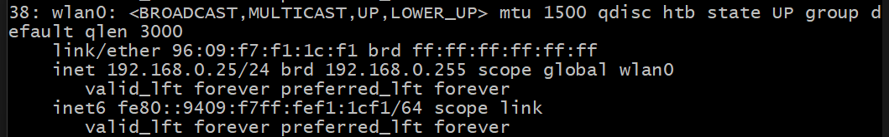

# appium笔记
## appium的安装
1. 检查nodejs是否安装,以及npm(JavaScript包管理)是否安装
```shell
    node -v
    npm -v
```
2. 没有安装需要安装nodejs
    >https://nodejs.org/en/download/prebuilt-installer
3. 安装appium
```shell
    npm install -g appium
```
4. 检查是否成功安装appium
```shell
   appium --version
   which appium(查看appium位置)
```
5. 运行appium服务器(ctrl+c停止)
```shell
    appium 
```
6. 安装appium-doctor,检查依赖是否安装完全
```shell
npm install -g appium-doctor
```
7. 检查是否安装成功
```shell
appium-doctor --version
```
8. 运行appium-doctor
```shell
#查看运行帮助
appium doctor -h
#查看Android运行环境
appium doctor --android
# 查看iOS运行环境
appium doctor --ios 
```
9. 检查驱动是否安装
```shell
#查看安装的驱动
appium driver list
#安装Android驱动
appium driver install uiautomator2
#安装iOS驱动
appium driver install xcuitest
#查看可更新的驱动
appium driver list --updates
```
10. 运行appium server
```shell
appium
#需要跨域时
appium --allow-cors
```
## 安装安卓测试的依赖(使用androidstudio GUI)
1. 安装Androidstudio
    >https://developer.android.com/studio?hl=zh-cn
2. 解压并安装,安装时最好在D盘设置sdktools给sdk
3. 进入设置->sdk manager,选择sdk platforms和sdk tools
4. sdk platforms中下载Android版本
5. sdk tools下载build-tools,android emulator,platform-tools
6. 在系统设置里配置ANDROID_HOME

***变量值设置为存放sdk的文件夹位置***
7. 检查安卓测试依赖是否安装完成

出现以下图片就代表安装完成
### 安装安卓虚拟设备(使用androidstudio GUI)
1. 打开安卓studio

2. 设置 -> AVD Manager (or click the AVD Manager icon in the toolbar)

3. 点击Create Virtual Device 选择设备 (phone or tablet) 和Android版本

4. 点击下一步并分配内存 (name, RAM, storage etc.)

5. 点击完成创建虚拟设备

6. 启动虚拟设备

7. 检查是否可以运行
### 安装物理安卓设备
1. 关于本机->版本信息->点击版本号三次
2. 系统更新->开发者选项->打开usb设备调试
3. 用数据线连接设备
4. 检查设备是否连接
```shell
    adb devices
```
### adb常用命令
1. 查看设备列表
```shell
adb devices
```
2. 重启设备
```shell
adb reboot
```
3. 推送文件到设备
```shell
adb push (local_file) (remote_location)
```
4. 设备拉取文件
```shell
adb pull (remote_file) (local_location)
```
5. 安装apk
```shell
adb install <apk_file_path>
```
6. 卸载apk
```shell
adb uninstall <package_name>
```
7. 查看已经安装的包
```shell
adb shell pm list packages
```
8. 查看设备日志
```shell
adb logcat
```
9. 将日志保存到文件
```shell
adb logcat > log.txt
```
10. 进入设备的shell
```shell
adb shell
```
11. adb无线连接
* 启用无线调试：
    1. 确保设备和计算机在同一网络下。
    2. 连接设备并启用无线调试：
        ```shell
        adb tcpip 5555
        ```
    3. ipv4地址查看
        ```shell
        adb shell ip addr show
        ```
        使用inet地址就行
        
    4. 断开 USB 连接，通过 IP 地址连接设备(ipv4地址)：
        ```shell
        adb connect <device_ip>
        ```
    5. 断开无线连接：
        ```shell
        adb disconnect <device_ip>
        ```
### monkey 测试
Monkey测试（Monkey Testing）是一种软件测试方法，主要目的是通过随机的、无计划的输入来测试系统的稳定性和鲁棒性。Monkey测试的核心思想是通过不按常理出牌、无目标地进行操作，来寻找可能的缺陷或异常行为。
1. Android Monkey:
Android提供了一个叫做 Monkey 的命令行工具，可以在Android设备上执行随机的用户操作来测试应用程序的稳定性。可以使用以下命令运行：

    ```shell
    adb shell monkey -p com.example.app -v 500
    ```
    其中<kbd>-p</kbd>指定包名,<kbd>-v</kbd>控制输出的详细程度,500 表示要执行500个随机事件。
示例:

    ```shell
    adb shell monkey -p com.example.app --throttle 100 --ignore-crashes --ignore-timeouts -v 5000
    ```
## 安装appium inspector(物理安卓设备)
1. 官网下载appium inspector
    > https://github.com/appium/appium-inspector
2. 往下划点击release,下载对应的Windows版本
3. 安装完成后打开,点击start session(在启动前确保启动appium服务器,网页端需要使用跨域启动appium)
4. 此时应该会看到" the error message for desired capabilities and not for appium server"
5. 添加设备相关信息

* automationname:通常为自动化驱动,可以通过appium driver list查看,安卓通常为uiautomator2,苹果统称为xcuitest
* platformname:安卓是Android,苹果是iOS
* platformversion:系统版本,通过adb shell getprop ro.build.version.release查看
* devicename:设备名称,通过adb devices查看
* app:测试的app的位置
1. 也可用json文件
eg:
{
  "appium:automationName": "UiAutomator2",
  "appium:platformName": "Android",
  "appium:platformVersion": "11",
  "appium:deviceName": "4b316ae9",
  "appium:app": "/Users/raghavpal/Katalon Studio/Android Testing Project/androidapp/APIDemos.apk"
}
## ***安装appium inspector(虚拟安卓机)***
1. 启动appium服务器 appium --allow-cors 
2. 启动Emulator 或连接物理安卓设备
```shell
#所有虚拟机
emulator -list-avds
#启动特定虚拟机
emulator -avd AvdName
#保存应用和数据状态,但从头开始启动系统
emulator -avd avdname -no-snapshot-load
#恢复出厂设置
emulator -avd avdname -wipe-data
```
1. 设备相关信息同上
* automationname:通常为自动化驱动,可以通过appium driver list查看,安卓通常为uiautomator2,苹果统称为xcuitest
* platformname:安卓是Android,苹果是iOS
* platformversion:系统版本,通过adb shell getprop ro.build.version.release查看
* devicename:设备名称,通过adb devices查看
* app:测试的app的位置
1. 启动session
## appium inspector界面

1. source(源):可以查看元素信息,可与元素互动,可以点击或者sendkeys
2. 命令(command):可以执行一些简单的命令和判断
3. 手势(gesture):执行一些触屏操作
4. 录制(record):进行手势操作时可以录制,录制后自动生成语言代码
5. 会话信息(session):当前会话的信息
### 手势(gesture)
1. 点击操作
实现逻辑:移动到特定点位->手指按下去->手指抬起来
   1. move,虚拟机上选取一个点,设定操作时间
   2. pointer down(左点击,触屏一般没右击)
   3. pointer up(左点击,触屏一般没右击)
1. 滑动操作
实现逻辑:移动到特定点位->手指按下去->移动到特定点位->手指抬起来
   1. move,虚拟机上选取一个点,设定操作时间 
   2. pointer down(左点击,触屏一般没右击)
   3. move,虚拟机上选取一个点,设定操作时间
   4. pointer up(左点击,触屏一般没右击)
1. zoom in和zoom out操作
实现逻辑:因为前面操作一只手指就可以操作,放缩操作需要两个手指,所以需要创建新的手指。左手指移动到特定点位->左手执按下去->移动到特定点位->左手指松开。右手指同样操作

   1. move,虚拟机上选取一个点,设定操作时间 
   2. pointer down(左点击,触屏一般没右击)
   3. move,虚拟机上选取一个点,设定操作时间
   4. pointer up(左点击,触屏一般没右击)
   5. 添加右手指
   6. move,虚拟机上选取一个点,设定操作时间 
   7. pointer down(左点击,触屏一般没右击)
   8. move,虚拟机上选取一个点,设定操作时间
   9. pointer up(左点击,触屏一般没右击)
## Recorder录制
点击录制按钮后,需要在source资源内进行点击,滑动等操作,生成python脚本

## touch-action实现手势操作
1. 点击操作
```python
def tap(driver, x, y):
    action = TouchAction(driver)
    action.tap(x=x, y=y).perform()
```
2. 滑动操作
```python
def swipe(driver, start_x, start_y, end_x, end_y):
    action = TouchAction(driver)
    action.press(x=start_x, y=start_y).move_to(x=end_x, y=end_y).release().perform()
```
3. 长按操作
```python
def long_press(driver, x, y, duration=1000):
    action = TouchAction(driver)
    action.long_press(x=x, y=y, duration=duration).release().perform()
```
集中调用
```python
# 示例调用
swipe(driver, 100, 500, 100, 100)  # 滑动
tap(driver, 200, 300)  # 点击
long_press(driver, 300, 400, duration=1000)  # 长按
```
4. 进行zoom in(放大)操作
```python
def zoom_in(driver, finger1_start, finger1_end, finger2_start, finger2_end):
    action1 = TouchAction(driver)
    action1.press(x=finger1_start[0], y=finger1_start[1]).move_to(x=finger1_end[0], y=finger1_end[1]).release()

    action2 = TouchAction(driver)
    action2.press(x=finger2_start[0], y=finger2_start[1]).move_to(x=finger2_end[0], y=finger2_end[1]).release()

    MultiAction(driver).add(action1, action2).perform()
```
5. 进行zoom out(缩小)操作
```python
def zoom_out(driver, finger1_start, finger1_end, finger2_start, finger2_end):
    action1 = TouchAction(driver)
    action1.press(x=finger1_start[0], y=finger1_start[1]).move_to(x=finger1_end[0], y=finger1_end[1]).release()

    action2 = TouchAction(driver)
    action2.press(x=finger2_start[0], y=finger2_start[1]).move_to(x=finger2_end[0], y=finger2_end[1]).release()

    MultiAction(driver).add(action1, action2).perform()
```
集中调用
```python
# 示例调用
zoom_in(driver, (200, 500), (100, 400), (400, 500), (500, 600))
zoom_out(driver, (100, 400), (200, 500), (500, 600), (400, 500))
```
## 使用python-unittest编写脚本
```python
import unittest
from appium import webdriver
from appium.options.android import UiAutomator2Options

class AppiumTest(unittest.TestCase):
    def setUp(self):
        # 配置 Appium 选项
        options = UiAutomator2Options()
        options.platform_name = 'Android'
        options.device_name = 'emulator-5554'
        options.app = '/path/to/your/app.apk'
        options.automation_name = 'UiAutomator2'
        options.app_package = 'com.example.app'
        options.app_activity = 'com.example.app.MainActivity'

        # 初始化驱动
        self.driver = webdriver.Remote("http://127.0.0.1:4723", options=options)

    def test_login(self):
        # 测试登录功能
        username_field = self.driver.find_element_by_id('com.example.app:id/username')
        password_field = self.driver.find_element_by_id('com.example.app:id/password')
        login_button = self.driver.find_element_by_id('com.example.app:id/login_button')

        username_field.send_keys('testuser')
        password_field.send_keys('password123')
        login_button.click()

        # 验证登录是否成功
        welcome_message = self.driver.find_element_by_id('com.example.app:id/welcome_message')
            self.assertEqual(welcome_message.text, 'Welcome, testuser!')

    def tearDown(self):
        # 关闭驱动
        self.driver.quit()

if __name__ == '__main__':
    unittest.main()
```