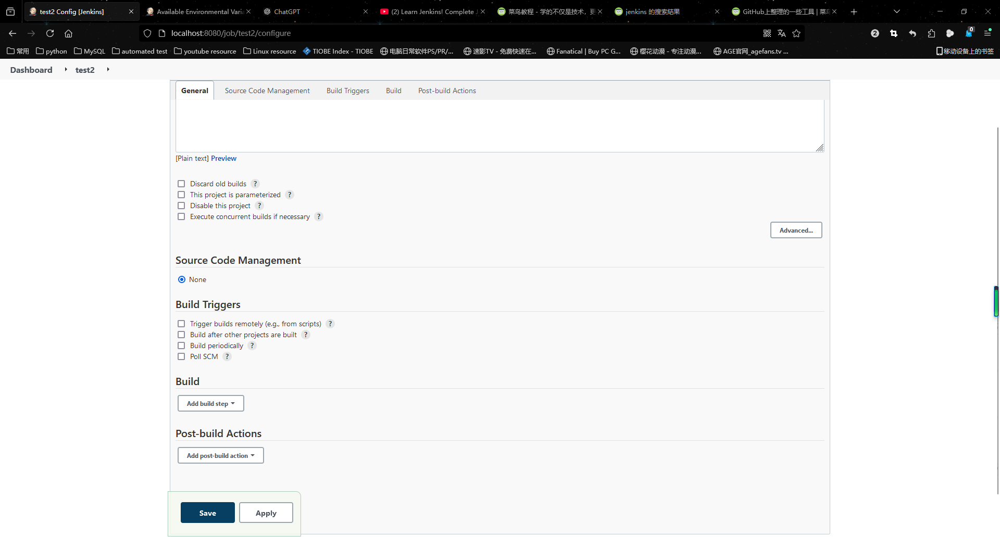

# jenkins笔记
## 使用docker安装Jenkins
1. 拉取Jenkins镜像
    >docker pull jenkins/jenkins:latest
    
    或者
    >docker pull jenkins:latest
    
    两者是等价的
2. 创建网络:
    >docker network create jenkins
3. 运行容器
```shell
docker run --name jenkins-latest --restart=on-failure --detach \
--network jenkins --env DOCKER_HOST=tcp://docker:2376 \
--env DOCKER_CERT_PATH=/certs/client --env DOCKER_TLS_VERIFY=0 \
--publish 8080:8080 --publish 50000:50000 \
--volume jenkins-data:/var/jenkins_home \
--volume jenkins-docker-certs:/certs/client:ro \
jenkins/jenkins:latest
```
4. 进入容器后获取密码
    1. 进入容器
        >docker exec jenkins-blueocean
    2. 获取密码
        >cat /var/jenkins_home/secrets/initialAdminPassword
5. 进入Jenkins网站进行配置

http://localhost:8080/ 输入获取到的密码进行安装配置
## Jenkins创建自由项目
1. 登录 Jenkins
    打开浏览器并访问 Jenkins 服务器的地址。输入用户名和密码登录 Jenkins 系统。
2. 进入 Jenkins 主界面
    登录后，您将看到 Jenkins 的主界面。
3. 点击“新建任务”
    在左侧菜单中，点击 “新建任务”（New Item）按钮。
4. 设置任务名称
    在弹出的对话框中，首先输入项目名称（例如：my-first-job）。确保您选择了 “自由风格项目”（Freestyle project）选项。然后，点击 “OK” 按钮。
5. 配置任务

在打开的项目配置页面，您可以对项目进行详细配置。常见的配置项包括：
   * 描述：为项目提供一个简短的描述，帮助您更好地理解项目的功能。
   * 源码管理：如果项目需要从版本控制系统（如 Git、SVN 等）获取代码，您可以在这里配置源码管理选项。对于 Git，您可以输入仓库 URL 和分支名。
   * 构建触发器：选择触发构建的条件。例如，您可以设置为：
   * 定时构建（例如每天凌晨构建一次）
   * 通过 webhook 触发（如 GitHub 提交代码时触发）
   * 构建环境：在这里，您可以配置构建环境，例如设置构建前或构建后的步骤。
    
   * 构建：在此区域设置实际的构建步骤。例如，选择 “执行 Shell” 来执行一段 Shell 脚本，或选择 “构建 Maven 项目” 来执行 Maven 构建。
6. 保存配置
    配置完成后，点击页面底部的 “保存”（Save）按钮。
7. 启动构建
    在项目的主页面，您可以点击 “立即构建”（Build Now）按钮来触发构建。
### Jenkins在Linux系统中的查看
1. 进入容器
>docker exec -it container_id /bin/bash (在容器内或在Linux系统下)

>winpty docker exec -it container_id /bin/bash (在windows系统下)

>exit (容器的退出)
* git bash只是一个类似于Linux系统的软件,不能直接代替Linux命令行,可以看作是Windows系统
2. 进入/var/jenkins_home文件夹
>cd /var/jenkins_home
3. 进入workspace
>cd workspace
## Jenkins构建并运行python文件
1. 进入Jenkins主界面
2. 创建python的自由项目
3. 填写git repository

4. 构建步骤选择执行shell,参数写python3,和执行文件

5. 点击构建

***注意:如果无法运行python文件说明Jenkins容器内没有安装python3***

* 在dockers版本Jenkins 容器内安装python3:
  1. 在windows版本git bash运行:
        >winpty docker exec -it --user root jenkins-latest bash(需要管理员权限)
  2. 执行安装命令:
        >apt-get update
        
        >apt-get install -y python3 python3-pip
  3. 在容器内部检查是否安装好python3:
        >python3 --version
## 使用docker设置Jenkins代理
1. 首先安装docker插件,在管理插件里安装docker
2. 选择云服务器,创建一个新的云服务器

1. 选择docker云服务器,输入名字

* docker host url通过以下命令查看:
    >docker inspect (container_id or container_name) 

    ipaddress的值就是docker host url

    输入格式为tcp://172.19.0.3:2375
1. 完成后点击保存,点击管理节点

***注意:功能不完善***
## 创建流水线(blue-ocean)
1. 进入bule ocean,创建流水线
2. 选择代码仓库,输入token,若没有需要生成
3. 选择授权的组织和代码仓库
4. 创建流水线,添加步骤,保存并运行


***注意:如果GitHub api请求超过限制按照以下方法解决:***
***jekins配置->系统设置->github api usage->github api usage rate limiting strategy 调整为never check rate limit***

***需要生成github token时候,选择settings->Developer settings->Personal access tokens->token生成新的token***
## 创建构建触发器(Poll SCM-poll source code management)
当你选择了 Poll SCM 并设置了扫描间隔后，Jenkins会按照你配置的时间间隔定期检查源代码仓库是否有新的提交。如果仓库有变动，Jenkins就会自动触发构建。
1. 进入blue ocean,选择项目,点击configuration
2. 选择扫描仓库触发器,选择间隔